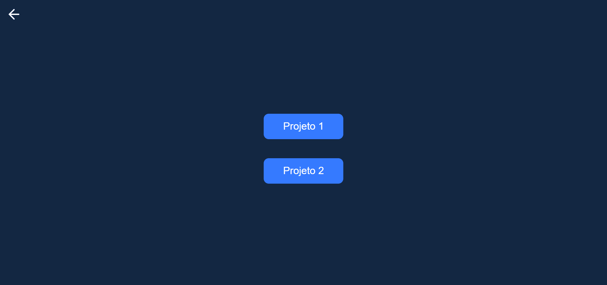

# Semana ReactJS - Sujeito Programador

Link para acessar o projeto: <a href="https://semana-reactjs.vercel.app" target="_blank">semana-reactjs.vercel.app</a> 

  

## Repositório desenvolvido para realizar a semana ReactJS, ministrada pelo canal do Sujeito Programador.

### Seções do curso: 
- [x] Passo 1 - Introdução da semana e criação do projeto
- [x] Passo 2 - Configuração do ambiente
- [x] Passo 3 - Projeto I
- [x] Passo 4 - Projeto II

### NextLevel da aplicação(mudanças pessoais):
- [x] Passo 1 - Criar um painel de entrada
- [x] Passo 2 - Criar novas animações

